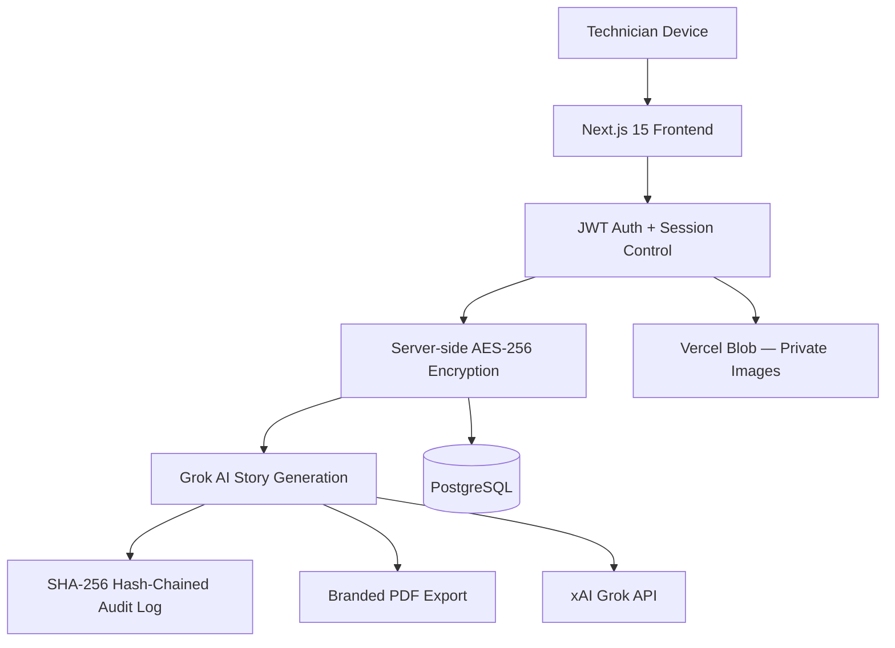

# Merlin — Mercedes-Benz Warranty Story Generator

**Secure AI-Powered Warranty Documentation Platform for Mercedes-Benz Dealerships**

[](https://nextjs.org/)
[](https://www.typescriptlang.org/)
[](https://www.prisma.io/)
[](https://github.com/Nicequantum/viti-ai-clone)

A secure, enterprise-grade platform designed specifically for Mercedes-Benz dealerships. Merlin enables technicians to generate accurate, professional warranty narratives using Grok AI, with built-in voice input, AES-256-GCM encryption, and a tamper-evident hash-chained audit trail.

---

## Who This Is For

| Role | Primary Value |
|------|---------------|
| **Technicians** | Fast, voice-driven warranty story creation with professional output |
| **Service Managers** | Complete visibility, audit logs, and team management |
| **Fixed Ops Directors** | Secure, compliant, and scalable warranty documentation system |

---

## Key Features

- Voice-first input with stable text editing
- High-quality Grok AI warranty story generation
- Field-level AES-256-GCM encryption
- Immutable SHA-256 hash-chained audit trail
- Professional branded PDF generation
- Client-side image compression and secure storage
- Role-based access control with instant session revocation

---

## Architecture Overview



---

## How It Works

1. Technician logs in and opens a repair order
2. Enters data using voice or form input
3. Sensitive data is encrypted before storage
4. A sanitized prompt is sent to Grok AI
5. Professional warranty story is generated
6. Every action is logged in the immutable audit chain
7. Technician reviews and exports a branded PDF

All steps are fully logged and auditable.

---

## Security & Compliance

- AES-256-GCM encryption for sensitive data
- SHA-256 hash-chained audit trail for tamper detection
- Session revocation on password change or logout
- Private image storage with session-gated access
- Signed DPA required with xAI before production customer data

---

## Common Failure Modes & Troubleshooting

| Issue | Symptom | Fix |
|-------|---------|-----|
| **Grok Timeout** | Long spinner or timeout | Shorten input and retry |
| **Voice Not Working** | Microphone inactive | Allow permission in Chrome/Edge |
| **PDF Generation Fails** | PDF download fails | Fill required fields and regenerate story |

---

## Getting Started

```bash
git clone https://github.com/Nicequantum/viti-ai-clone.git
cd viti-ai-clone
npm install
cp .env.example .env.local
npm run db:migrate:deploy
npm run dev
```

---

Built for Mercedes-Benz dealerships that need both speed and compliance.

**Repository:** [github.com/Nicequantum/viti-ai-clone](https://github.com/Nicequantum/viti-ai-clone)