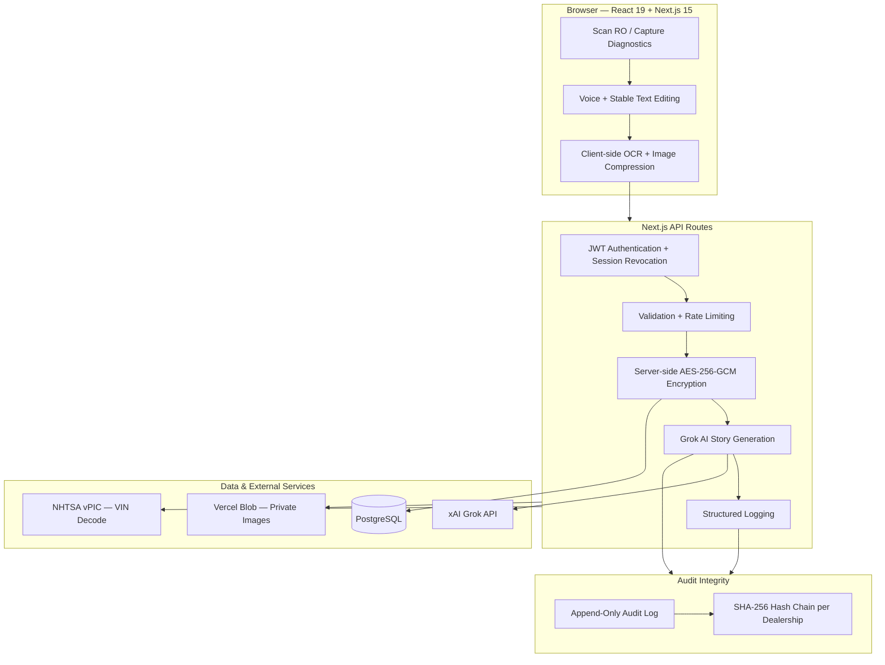

# Benz Tech — Mercedes-Benz Warranty Story Generator

[](https://nextjs.org/)
[](https://www.typescriptlang.org/)
[](https://www.prisma.io/)
[](https://github.com/Nicequantum/viti-ai-clone)

A secure, purpose-built platform that enables Mercedes-Benz service technicians to generate accurate, professional warranty narratives using Grok AI, while maintaining full audit integrity and compliance controls.

---

## Who This Is For

| Role | Key Benefits |
|------|--------------|
| **Technicians** | Fast voice input, AI-generated warranty stories, one-click PDF export |
| **Service Managers** | Complete visibility, user management, full audit trail with hash chaining |
| **Fixed Ops Directors** | Enterprise-ready platform with strong security, session controls, and compliance features |

---

## Key Features

- Voice-first input with stable text editing and cursor preservation
- Grok AI-powered intelligent warranty story generation
- AES-256-GCM encryption at rest for all sensitive customer, vehicle, and story data
- Immutable SHA-256 hash-chained audit trail (tamper-evident)
- Client-side image compression and secure blob storage
- Professional branded PDF generation
- Stable UI patterns designed for dealership shop-floor use
- Role-based access control with instant session revocation
- Built on Next.js 15 with React 19

---

## Architecture Overview



**Core security principles:**

- Sensitive fields are encrypted server-side before PostgreSQL storage
- API keys and encryption keys never leave the server
- Every action is cryptographically linked in a per-dealership hash chain
- Session revocation is instant on password change, deactivation, or logout

---

## How It Works

1. Technician logs in and starts a new repair order
2. Enters data using voice input or manual entry
3. Sensitive data is encrypted on the server before storage
4. A secure, audit-safe prompt is sent to Grok AI
5. Professional warranty narrative is generated and returned
6. Every action is recorded in the immutable hash-chained audit log
7. Technician reviews, makes changes if needed, and exports a branded PDF

---

## Common Failure Modes & Troubleshooting

| Issue | Symptom / Error Message | Recommended Fix |
|-------|-------------------------|-----------------|
| **Grok API Timeout** | Long spinner or "Request timed out" | Shorten input, wait 15 seconds, then click **Regenerate** |
| **Voice Input Not Working** | Microphone does nothing or permission error | Allow microphone permission in Chrome or Edge; speak clearly 6–8 inches from the device |
| **PDF Generation Failed** | "Failed to generate PDF" | Fill all required fields and regenerate the story first |
| **Encryption Error** | Security-related error during save | Contact IT immediately — do not attempt to bypass |
| **Session Expiring Frequently** | Unexpected logout | Check device time settings and clear browser cache |
| **Hash Chain Integrity Warning** | Audit log shows broken chain | Stop use and immediately notify IT and Service Manager |
| **Database / Loading Issues** | Slow performance or connection errors | Refresh the page; contact IT if persistent across devices |

---

## Quick Start (Development)

```bash
git clone https://github.com/Nicequantum/viti-ai-clone.git
cd viti-ai-clone
npm install
cp .env.example .env
```

Configure environment variables (minimum required):

| Variable | Description |
|----------|-------------|
| `DATABASE_URL` | PostgreSQL connection string |
| `SESSION_SECRET` | `openssl rand -base64 32` |
| `ENCRYPTION_KEY` | `openssl rand -hex 32` (64 hex chars) |
| `GROK_API_KEY` | xAI key — server-side only |
| `BLOB_READ_WRITE_TOKEN` | Vercel Blob private storage |
| `ADMIN_SEED_PASSWORD` | Manager password for `npm run db:seed` — never commit |

Then run:

```bash
npm run db:migrate:deploy
ADMIN_SEED_PASSWORD="your-secure-password" npm run db:seed   # first-time setup only
npm run dev
```

Open [http://localhost:3000](http://localhost:3000). Upgrading an existing database? Run `npm run db:reencrypt` after migrations.

---

## Production Deployment & Pre-Production Checklist

Optimized for **Vercel + PostgreSQL**. Connect branch `main`, set all variables from `.env.example`, and deploy with `npm run build`.

**Critical requirement:** A signed Data Processing Agreement (DPA) with xAI must be completed before processing any real customer or vehicle data in production.

### Pre-Production Checklist

- [ ] **Environment configured** — `DATABASE_URL`, `SESSION_SECRET`, `ENCRYPTION_KEY`, `ADMIN_SEED_PASSWORD` set on host
- [ ] **Database migrated** — `npm run db:migrate:deploy` completed without errors
- [ ] **Legacy data re-encrypted** — `npm run db:reencrypt` run if upgrading an existing database
- [ ] **Accounts provisioned** — seed passwords rotated via Settings
- [ ] **Health check green** — `GET /api/health` returns `"status": "ok"`
- [ ] **Audit chain valid** — Audit Log shows hash-chain integrity **VALID**
- [ ] **xAI DPA executed** — business account and data processing agreement finalized
- [ ] **CI passing** — GitHub Actions workflow green on `main`

---

## Security & Compliance

**Encrypted at rest (AES-256-GCM):** customer name, VIN, service advisor name, RO complaints, technician notes, XENTRY OCR text, extracted diagnostic data, warranty stories, knowledge-base content, and saved templates.

**Additional controls:** tamper-evident hash-chained audit logging, session revocation, session-gated image proxy (`/api/images`), audit-safe AI prompts (`[NOT DOCUMENTED]` / `[NOT PROVIDED]`), structured logging, and distributed rate limiting via Vercel KV.

---

## API Endpoints

| Endpoint | Auth | Description |
|----------|------|-------------|
| `GET /api/health` | Public | Service health and dependency probes |
| `GET /api/auth/security-status` | Public | Detects default seed passwords still in use |
| `GET /api/dashboard/summary` | Session | Manager/tech dashboard metrics |
| `GET /api/audit-logs/summary` | Manager | Audit stats + chain verification |
| `GET /api/audit-logs` | Manager | Filtered log list or CSV export |

---

## Project Structure

```
prisma/migrations/     # Versioned schema migrations
scripts/               # Re-encryption and setup utilities
src/app/api/           # REST API routes
src/components/        # UI + StableTextarea, VoiceInputButton
src/lib/               # Auth, encryption, audit chain, logging
src/prompts/           # Audit-safe AI prompt templates
```

| Command | Purpose |
|---------|---------|
| `npm run dev` | Local development server |
| `npm run build` | Production build |
| `npm run db:migrate:deploy` | Apply migrations (production) |
| `npm run db:reencrypt` | Re-encrypt legacy plaintext rows |
| `npm run db:seed` | Seed dealership and initial accounts |
| `npm test` | Run unit + integration tests |

---

## Current Limitations

| Limitation | Mitigation |
|------------|------------|
| **Pending xAI DPA** | Complete xAI business onboarding before live customer data |
| **Advisor profile plaintext** | `AdvisorWritingProfile.profileData` pending next encryption pass |
| **Human review required** | Technicians must verify every AI story before warranty submission |

---

**Note:** This platform is intended for authorized Mercedes-Benz dealerships only.

**Repository:** [github.com/Nicequantum/viti-ai-clone](https://github.com/Nicequantum/viti-ai-clone)

*Built specifically for Mercedes-Benz Fixed Operations teams who require both speed and full accountability.*

## License

Proprietary — for authorized Mercedes-Benz dealership use.