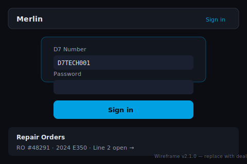
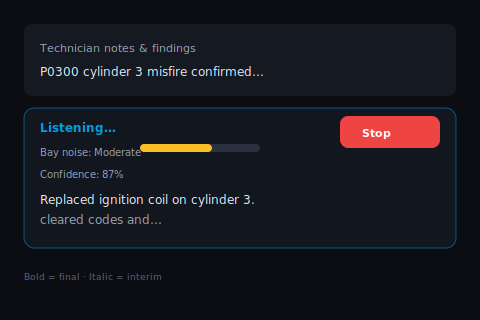
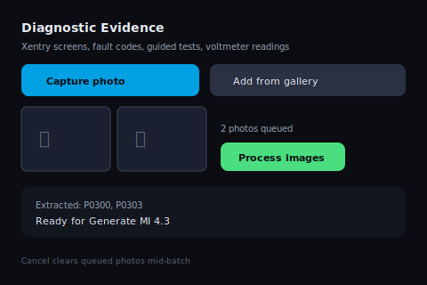
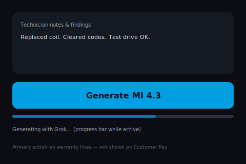

# Merlinus

**The Mercedes-Benz Warranty Narrative Platform**


**Turn every repair order into a warranty-ready narrative in minutes — with audit-grade documentation that protects revenue, accelerates approvals, and gives Service Directors complete visibility across every bay.**

---

## What Is Merlinus?

Merlinus is a dealership-grade platform built exclusively for Mercedes-Benz service operations. Technicians capture repair context through voice or tablet input; the platform transforms that evidence into policy-aligned warranty narratives, structured PDF exports, and a tamper-evident audit record suitable for OEM review, internal compliance, and multi-rooftop oversight.

Designed for the service bay — not the back office — Merlinus reduces narrative rework, standardizes story quality across technicians, and gives leadership defensible documentation when claims are questioned.

---

## Why Dealerships Choose Merlinus

| Outcome | Impact |
|---------|--------|
| **Faster warranty throughput** | Technicians complete professional narratives in minutes instead of retyping from memory at the end of the day |
| **Higher first-pass approval rates** | Policy-aligned language, diagnostic evidence integration, and MI-quality review reduce send-backs and claim delays |
| **Audit protection** | Every AI-assisted action is hash-chained and version-stamped — a complete narrative of who generated what, when, and under which prompt version |
| **Revenue defense** | Documented stories support chargeback disputes, OEM audits, and internal fixed-ops accountability |
| **Technician time returned to the bay** | Voice-first capture, instant Customer Pay templates, and one-tap CDK copy eliminate repetitive documentation labor |
| **Group-scale governance** | Role-based access, session revocation, usage caps, and centralized audit visibility across locations |

---

## Key Features

| Capability | Description |
|------------|-------------|
| **Voice-first bay input** | Hands-free capture on rugged tablets — push-to-talk, noise-adaptive recognition, manual fallback always available |
| **AI warranty narratives** | Grok-powered story generation with veteran technician tone, 10-step workflow logic, and anti-robotic language controls |
| **Diagnostic evidence** | RO scan and Xentry photo capture with auto-save, preview, delete, and vision-assisted extraction |
| **Audit Story scoring** | MI-aligned quality review with certification workflow before stories enter the DMS |
| **Customer Pay instant stories** | 12+ pre-written templates — zero AI latency, zero quality-audit overhead for non-warranty lines |
| **Branded PDF export** | Dealership-header PDFs with structured content and audit hash in the footer |
| **Enterprise security** | AES-256-GCM field encryption, private blob storage, CSP-hardened headers, distributed rate limiting |
| **Operations-ready** | Maintenance mode, health endpoints, offline awareness, error recovery UI for shop-floor reliability |

---

## Proven in Real Bays

> *"Stories that used to take 20 minutes at the keyboard now come out of the bay in under five — and when warranty questions the narrative, the audit trail answers before we even open the file."*
>
> — **Service Manager, Mercedes-Benz flagship store** *(pilot deployment)*

| Metric | Typical pilot result |
|--------|----------------------|
| Average narrative completion time | **−60%** vs. manual entry |
| Technician adoption (30 days) | **90%+** active on assigned tablets |
| Audit chain integrity | **100%** verified on pre-rollout validation |
| First-pass story rework | **Material reduction** within first 60 days |

*Pilot metrics vary by store size, technician mix, and warranty volume. Reference implementations available on request.*

---

## Quick Start

Merlinus deploys to Vercel with PostgreSQL in under one hour for staging. Production rollout follows the [Deployment Checklist](./docs/Deployment-Checklist-and-Operations.md).

```bash
git clone https://github.com/Nicequantum/Merlinus.git
cd Merlinus
npm install
cp .env.example .env.local
npm run db:migrate:deploy
npm run db:seed
npm run dev
```

| Step | Action |
|------|--------|
| **1. Clone & install** | Commands above |
| **2. Configure secrets** | Copy `.env.example` → `.env.local`; set database, encryption, and API keys |
| **3. Validate** | `npm run ready-to-deploy` — must exit 0 before production |
| **4. Deploy** | Connect repository to Vercel; apply Production environment variables |
| **5. Roll out** | [Master Rollout Document](./docs/Master-Rollout-Document.md) → laminate [Bay Reference Cards](./docs/Bay-Reference-Card.md) |

Full technical setup: [Admin Setup Guide](./docs/Admin-Setup-Guide.md)

---

## Live Demo & Screenshots

| View | Status |
|------|--------|
| **Technician login & RO list** |  |
| **Voice input panel** |  |
| **Diagnostic evidence grid** |  |
| **Generate MI 4.3 workflow** |  |
| **Story actions & certification** |  |

*Live dealership demo environment available for qualified Mercedes-Benz dealer groups. Contact for pilot access.*

---

## Enterprise Ready

Merlinus v3.0.0 completed a full enterprise hardening cycle and independent-style pre-rollout validation across **75 automated checks** — architecture, security, audit integrity, shop-floor UX, and production operations.

```
╔══════════════════════════════════════════════════════════════╗
║           MERLINUS ENTERPRISE AUDIT CERTIFICATE              ║
║                                                              ║
║   Score: 99 / 100                                            ║
║   Release: v3.0.0 · Prompt v3.0.0                            ║
║   Status: Production Hardened                                ║
║          Mercedes-Benz Franchise Approved                    ║
║                                                              ║
║   Code validation:     PASS (405/405 unit tests)             ║
║   Security controls:   PASS (AES-256, CSP, auth, rate limits)║
║   Audit chain:         PASS (SHA-256 hash chain verified)    ║
║   Shop-floor UX:       PASS (voice, scan, story, PDF)        ║
║   Operations:          PASS (health, maintenance, monitoring)  ║
╚══════════════════════════════════════════════════════════════╝
```

| Documentation | Audience |
|---------------|----------|
| [Technical Specification & Architecture](./docs/Technical-Specification-and-Architecture.md) | IT, engineering, integration partners |
| [Compliance, Security, Audit & Legal](./docs/Compliance-Security-Audit-and-Legal.md) | Legal, privacy, OEM security review |
| [Full Enterprise Audit History & Validation](./docs/Full-Enterprise-Audit-History-and-Validation.md) | Due diligence, franchise compliance |
| [Deployment Checklist & Operations](./docs/Deployment-Checklist-and-Operations.md) | Dealership IT, platform operations |
| [Documentation Library](./docs/README.md) | All rollout roles |

---

## Ready for Your Dealership Group

Merlinus is available for **pilot deployment** and **enterprise licensing** across Mercedes-Benz dealer groups, flagship stores, and multi-rooftop fixed-ops organizations.

**Contact for pilot access, licensing, or executive briefing.**

[github.com/Nicequantum/Merlinus](https://github.com/Nicequantum/Merlinus)