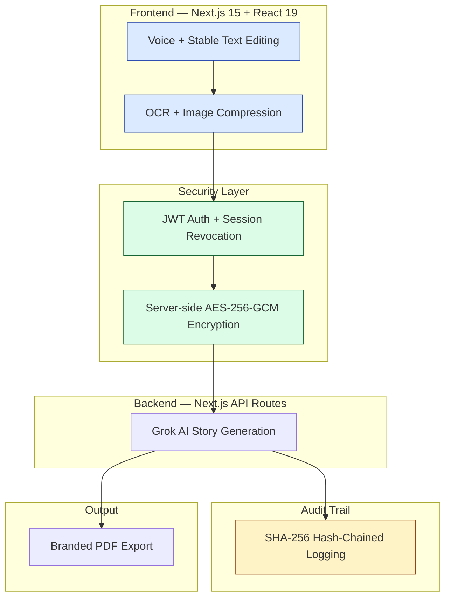

# Merlin — Mercedes-Benz Warranty Story Generator

**Secure AI-Powered Warranty Documentation Platform for Mercedes-Benz Dealerships**

[](https://nextjs.org/)
[](https://www.typescriptlang.org/)
[](https://www.prisma.io/)
[](https://github.com/Nicequantum/viti-ai-clone)

A secure, enterprise-grade platform that enables Mercedes-Benz service technicians to generate accurate, professional warranty narratives using Grok AI — complete with voice input, field-level encryption, and a tamper-evident audit trail.

---

## Who This Is For

| Role | What You Get |
|------|--------------|
| **Technicians** | Fast voice-to-story workflow and professional PDF output |
| **Service Managers** | Full visibility, audit logs, user management, and compliance tools |
| **Fixed Ops Directors** | A secure, auditable, and scalable warranty documentation system |

---

## Key Features

- Voice-first input with stable text editing during dictation
- Intelligent Grok AI-powered warranty story generation
- AES-256-GCM encryption for all sensitive data
- Immutable SHA-256 hash-chained audit trail
- Client-side image compression and secure storage
- Professional branded PDF generation
- Role-based access control with instant session revocation
- Built for reliability in high-pressure dealership environments

---

## Architecture Overview



---

## Common Failure Modes & Troubleshooting

| Issue | Error Message / Symptom | Recommended Fix |
|-------|-------------------------|-----------------|
| **Grok API Timeout** | Request timed out or long loading spinner | Shorten your input and click **Regenerate** |
| **Voice Input Not Working** | Microphone does not respond | Allow microphone permission in Chrome or Edge |
| **PDF Generation Failed** | Failed to generate PDF | Ensure all required fields are filled, then regenerate story |
| **Session Expiring Frequently** | Logged out unexpectedly | Check device clock or clear browser cache |
| **Audit Chain Warning** | Hash chain integrity error | Stop use and notify IT immediately |

---

## Getting Started

```bash
git clone https://github.com/Nicequantum/viti-ai-clone.git
cd viti-ai-clone
npm install
cp .env.example .env.local
npm run dev
```

---

**Important:** A signed Data Processing Agreement with xAI is required before processing real customer or vehicle data.

Built specifically for Mercedes-Benz Fixed Operations teams that demand both speed and full accountability.