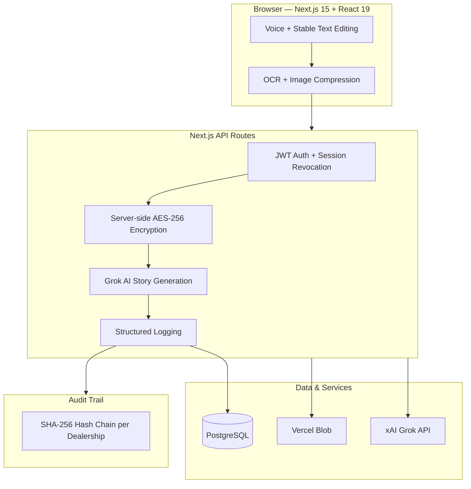

# Benz Tech — Mercedes-Benz Warranty Story Generator

**Secure AI-Powered Warranty Documentation Platform for Mercedes-Benz Dealerships**

[](https://nextjs.org/)
[](https://www.typescriptlang.org/)
[](https://www.prisma.io/)
[](https://github.com/Nicequantum/viti-ai-clone)

A secure, purpose-built platform that enables Mercedes-Benz service technicians to generate accurate, professional warranty narratives using Grok AI, while maintaining full audit integrity and compliance controls.

---

## Who This Is For

| Role | Key Benefits |
|------|--------------|
| **Technicians** | Fast voice input, AI-generated warranty stories, one-click PDF export |
| **Service Managers** | Complete visibility, user management, full audit trail with hash chaining |
| **Fixed Ops Directors** | Enterprise-ready platform with strong security, session controls, and compliance features |

---

## Key Features

- Voice-first input with stable text editing and cursor preservation
- Grok AI-powered intelligent warranty story generation
- AES-256-GCM encryption at rest for all sensitive data
- Immutable SHA-256 hash-chained audit trail
- Client-side image compression and secure blob storage
- Professional branded PDF generation
- Role-based access control with instant session revocation

---

## Architecture Overview



---

## Common Failure Modes & Troubleshooting

| Issue | Symptom | Fix |
|-------|---------|-----|
| **Grok API Timeout** | Long loading or timeout message | Shorten input and click **Regenerate** |
| **Voice Input Not Working** | Microphone button does nothing | Allow microphone permission in Chrome or Edge |
| **PDF Generation Failed** | "Failed to generate PDF" | Fill all required fields, then regenerate story |
| **Frequent Logouts** | Session expires often | Check device time or clear browser cache |

---

## Getting Started

```bash
git clone https://github.com/Nicequantum/viti-ai-clone.git
cd viti-ai-clone
npm install
cp .env.example .env
npm run db:migrate:deploy
npm run dev
```

---

**Important:** This system requires a signed Data Processing Agreement (DPA) with xAI before processing real customer or vehicle data in production.

Built specifically for Mercedes-Benz Fixed Operations teams.