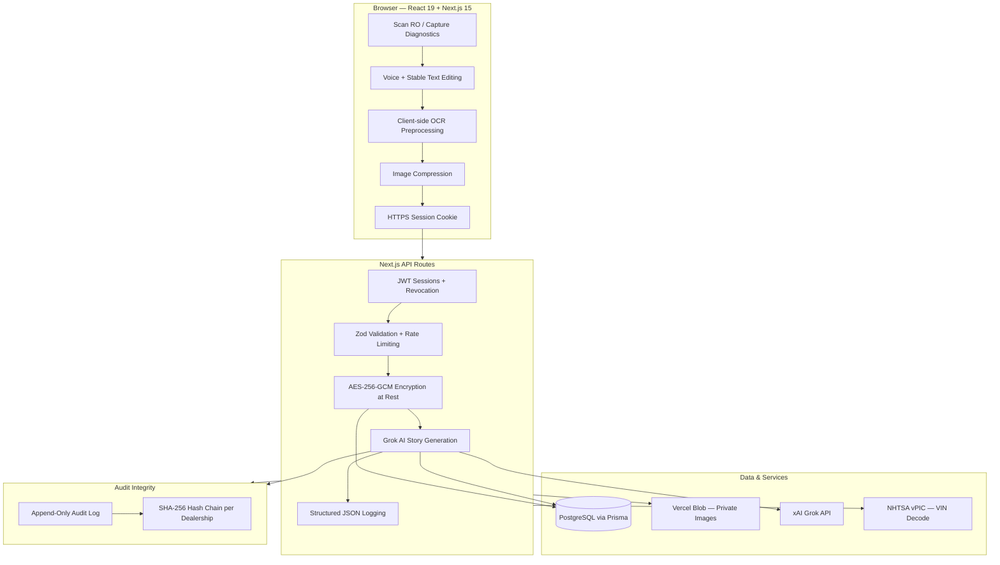

# Benz Tech — Mercedes-Benz Warranty Story Generator

[](https://nextjs.org/)
[](https://www.typescriptlang.org/)
[](https://www.prisma.io/)
[](https://github.com/Nicequantum/viti-ai-clone)

A purpose-built platform that enables Mercedes-Benz service technicians to generate accurate, professional warranty narratives using Grok AI — with enterprise-grade encryption, tamper-evident audit logging, and full compliance controls.

---

## Who This Is For

| Role | What You Get |
|------|--------------|
| **Technician** | Voice input, intelligent warranty story generation, PDF export |
| **Service Manager** | Full visibility, audit logs, user management, hash-chain verification |
| **Fixed Ops Director** | Compliance-ready platform with encryption, session controls, and audit integrity |

---

## Key Features

- Voice-first input with real-time transcription and cursor preservation
- Grok AI-powered professional warranty story generation
- AES-256-GCM encryption at rest for sensitive customer, vehicle, and story data
- Immutable SHA-256 hash-chained audit trail
- Stable text editing during voice input and rapid typing
- Client-side image compression and secure document upload
- Professional PDF generation with dealership branding
- Role-based access with session revocation
- Built on Next.js 15 with React 19

---

## Architecture Overview



**Core Security Principles:**

- Sensitive fields are encrypted server-side (AES-256-GCM) before PostgreSQL storage
- API keys and encryption keys never leave the server
- Audit logging occurs before PDF generation and AI story persistence
- Every action is cryptographically linked in a per-dealership hash chain
- Session revocation is instant on password change, deactivation, or logout

---

## How It Works

1. Technician logs in and opens a repair order
2. Captures data via voice or manual entry with real-time validation
3. Data is transmitted over HTTPS; sensitive fields are encrypted at rest on the server
4. A secure, audit-safe prompt is built and sent to Grok AI
5. Professional warranty narrative is generated
6. Every step is recorded in the hash-chained audit log
7. Technician reviews, edits if needed, and exports a branded PDF

All changes and AI generations are permanently logged with cryptographic integrity.

---

## Common Failure Modes & Troubleshooting

| Issue | Error Message / Symptom | Step-by-Step Fix |
|-------|-------------------------|------------------|
| **Grok API Timeout** | "Request timed out" or long loading spinner | Shorten your input, wait 15 seconds, then click **Regenerate**. Check your internet connection. |
| **Voice Input Not Working** | Microphone does nothing or permission error | Allow microphone permission in your browser. Use Chrome or Edge. Speak clearly 6–8 inches from the tablet. |
| **PDF Generation Fails** | "Failed to generate PDF" | Make sure all required fields are filled, regenerate the story, then try again. |
| **Encryption Error** | Security-related error during save | Contact your IT administrator immediately. Do not attempt to bypass. |
| **Session Expired Frequently** | Logged out unexpectedly | Ensure your device clock is correct. Clear browser cache if the problem continues. |
| **Database Connection Issues** | Slow loading or connection errors | Refresh the page. Contact IT if the issue persists across multiple devices. |
| **Hash Chain Broken** | Audit log shows integrity warning | Stop use and immediately notify your Service Manager and IT team. |

---

## Quick Start (Development)

### 1. Clone and install

```bash
git clone https://github.com/Nicequantum/viti-ai-clone.git
cd viti-ai-clone
npm install
cp .env.example .env
```

### 2. Configure environment

| Variable | Required | Description |
|----------|----------|-------------|
| `DATABASE_URL` | Yes | PostgreSQL connection string |
| `SESSION_SECRET` | Yes | `openssl rand -base64 32` |
| `ENCRYPTION_KEY` | Yes | `openssl rand -hex 32` (64 hex chars) |
| `GROK_API_KEY` | For AI | xAI key — server-side only |
| `BLOB_READ_WRITE_TOKEN` | For uploads | Vercel Blob private storage |
| `KV_REST_API_URL` / `KV_REST_API_TOKEN` | Production | Vercel KV for distributed rate limiting |
| `ADMIN_SEED_PASSWORD` | For seed | Manager password for `npm run db:seed` — **never commit** |

### 3. Database setup

**Fresh database:**

```bash
npm run db:migrate:deploy
ADMIN_SEED_PASSWORD="your-secure-password" npm run db:seed
```

**Existing database with legacy plaintext rows** (after the content-field encryption migration):

```bash
npm run db:migrate:deploy
npm run db:reencrypt
```

> Use `npm run db:migrate` during development to create new migrations. Do not use `prisma db push` in production.

### 4. Run locally

```bash
npm run dev
```

Open [http://localhost:3000](http://localhost:3000)

**Seed accounts** (from `npm run db:seed`):

| Email | Password | Role |
|-------|----------|------|
| `admin@dealership.com` | Value of `ADMIN_SEED_PASSWORD` at seed time | Manager |
| `tech@dealership.com` | Value of `TECH_SEED_PASSWORD` or `changeme123` | Technician |

---

## Production Deployment

This application is optimized for Vercel with PostgreSQL.

1. Connect the repo and select branch `main`
2. Add a **PostgreSQL** database (Vercel Postgres, Neon, or Supabase)
3. Set all environment variables from `.env.example`
4. Build command: `npm run build` (runs `prisma generate` and `prisma migrate deploy`)
5. After deploy, run legacy re-encryption if upgrading from an older database:

```bash
npm run db:reencrypt
```

6. Seed once (or provision accounts manually), then verify health: `GET /api/health`

**Important:** A signed Data Processing Agreement with xAI must be in place before using this system with real customer or vehicle data.

### Pre-Production Checklist

- [ ] **Environment configured** — `DATABASE_URL`, `SESSION_SECRET`, `ENCRYPTION_KEY`, `ADMIN_SEED_PASSWORD` set on host
- [ ] **Database migrated** — `npm run db:migrate:deploy` completed without errors
- [ ] **Legacy data re-encrypted** — `npm run db:reencrypt` run if upgrading an existing database
- [ ] **Accounts provisioned** — seed passwords rotated via Settings
- [ ] **Health check green** — `GET /api/health` returns `"status": "ok"`
- [ ] **Audit chain valid** — Audit Log shows hash-chain integrity **VALID**
- [ ] **xAI DPA executed** — business account and data processing agreement finalized
- [ ] **CI passing** — GitHub Actions workflow green on `main`

---

## Security & Compliance

**Encrypted at rest (AES-256-GCM):**

- Customer name, VIN, service advisor name
- RO complaints and per-line customer concerns
- Technician notes, XENTRY OCR text, extracted diagnostic data
- Warranty stories, knowledge-base content, and saved templates

**Additional controls:**

- Tamper-evident hash-chained audit logging (SHA-256, per dealership)
- Session revocation on password changes, deactivation, and logout
- Private image storage with session-gated `/api/images` proxy
- Audit-safe AI prompts using `[NOT DOCUMENTED]` / `[NOT PROVIDED]` instead of fabricated data
- Structured logging and rate limiting (Vercel KV in production)

---

## API Endpoints

| Endpoint | Auth | Description |
|----------|------|-------------|
| `GET /api/health` | Public | Service health and live dependency probes |
| `GET /api/auth/security-status` | Public | Detects if default seed passwords are still in use |
| `GET /api/dashboard/summary` | Session | Manager/tech dashboard metrics |
| `GET /api/audit-logs/summary` | Manager | Audit stats + chain verification |
| `GET /api/audit-logs` | Manager | Filtered log list or CSV export |

---

## Project Structure

```
prisma/migrations/     # Versioned schema migrations (use migrate deploy)
scripts/               # Re-encryption and setup utilities
src/app/api/           # REST API routes
src/components/        # UI views + StableTextarea, VoiceInputButton, ErrorBoundary
src/lib/               # Auth, encryption, audit chain, logging
src/prompts/           # Audit-safe AI prompt templates
src/services/          # Client-side OCR (Tesseract.js)
```

## Scripts

| Command | Purpose |
|---------|---------|
| `npm run dev` | Local development server |
| `npm run build` | Production build |
| `npm run db:migrate` | Create/apply migrations (dev) |
| `npm run db:migrate:deploy` | Apply migrations (production) |
| `npm run db:reencrypt` | Re-encrypt legacy plaintext rows after encryption migration |
| `npm run db:seed` | Seed dealership and initial accounts |
| `npm test` | Run unit + integration tests |

---

## Current Limitations

> **Do not process real customer data until the xAI business account and Data Processing Agreement (DPA) are finalized.**

| Limitation | Impact | Mitigation |
|------------|--------|------------|
| **Pending xAI DPA** | RO text, VINs, diagnostic images, and OCR content are sent to xAI Grok for extraction and warranty story generation. | Complete xAI business onboarding and execute DPA before live customer data. |
| **Advisor profile plaintext** | `AdvisorWritingProfile.profileData` remains plaintext pending a future migration. | Restrict DB access; include in next encryption pass. |
| **Hash chain scope** | Chain verifies append-only integrity per dealership; a privileged DBA could rewrite the full table. | Pair with CSV exports, least-privilege DB access, and off-site backup retention. |
| **Human review required** | AI-generated warranty stories are drafts only. | Technicians must verify every story before Mercedes-Benz warranty submission. |
| **Rate limiting fallback** | Without Vercel KV, rate limits are per-instance only on multi-node deployments. | Configure `KV_REST_API_URL` and `KV_REST_API_TOKEN` in production. |

---

**Note:** This platform is intended for authorized Mercedes-Benz dealerships only. All warranty stories generated by AI must be reviewed and verified by a qualified technician before submission.

---

*Built for Fixed Operations teams who demand both speed and accountability.*

## License

Proprietary — for authorized Mercedes-Benz dealership use.